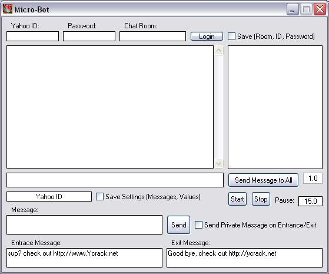



## YCht Protocol for Yahoo\!

### Description

This is an example I created, how to use 'ycht' to login a Yahoo! chat room, and how to do a lot of cool things while logged in.
 
### More Info
 

             |
---                |---
**Submitted On**   |2004-03-20 14:10:54
**By**             |[Brian Matthews](https://github.com/Planet-Source-Code/PSCIndex/blob/master/ByAuthor/brian-matthews.md)
**Level**          |Advanced
**User Rating**    |5.0 (15 globes from 3 users)
**Compatibility**  |VB 6\.0
**Category**       |[Miscellaneous](https://github.com/Planet-Source-Code/PSCIndex/blob/master/ByCategory/miscellaneous__1-1.md)
**World**          |[Visual Basic](https://github.com/Planet-Source-Code/PSCIndex/blob/master/ByWorld/visual-basic.md)
**Archive File**   |[YCht\_Proto1722413202004\.zip](https://github.com/Planet-Source-Code/brian-matthews-ycht-protocol-for-yahoo__1-52515/archive/master.zip)

